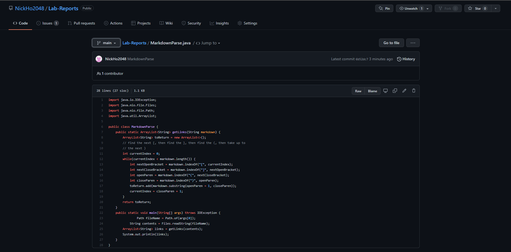
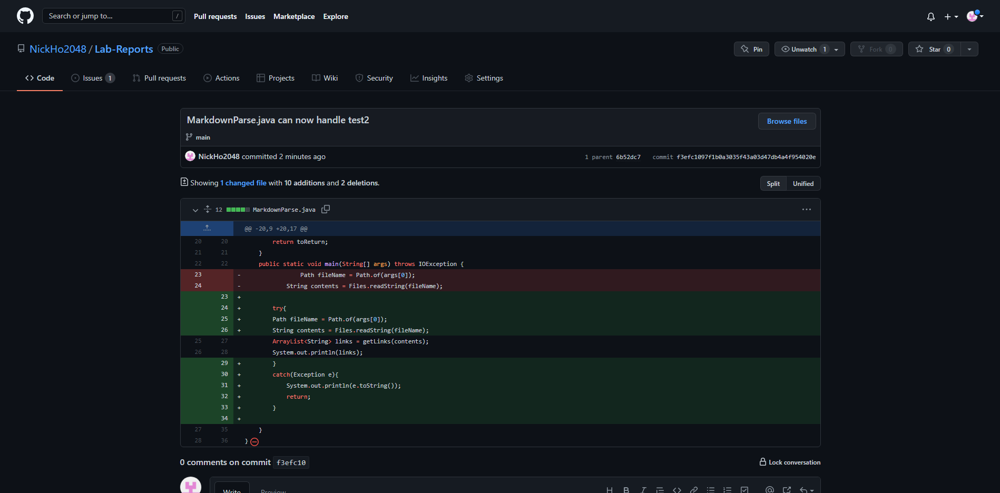
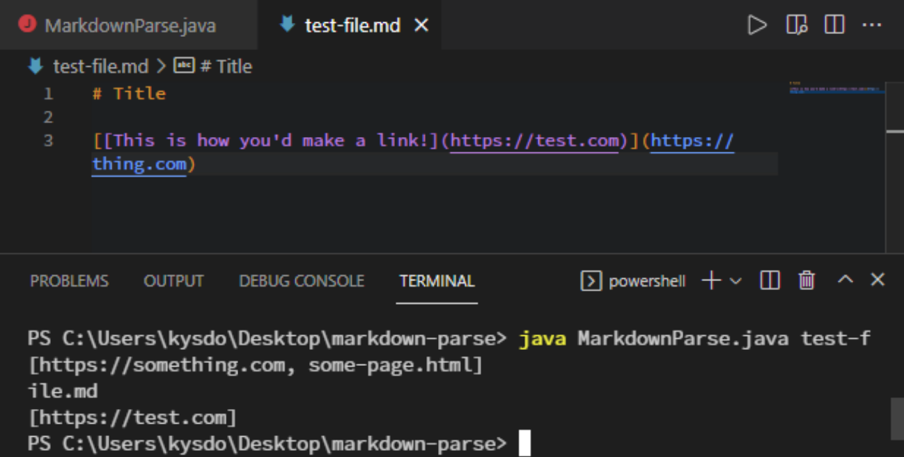
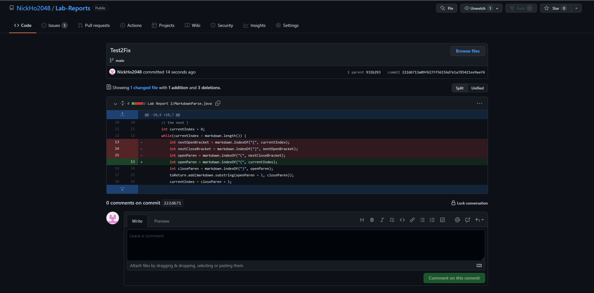
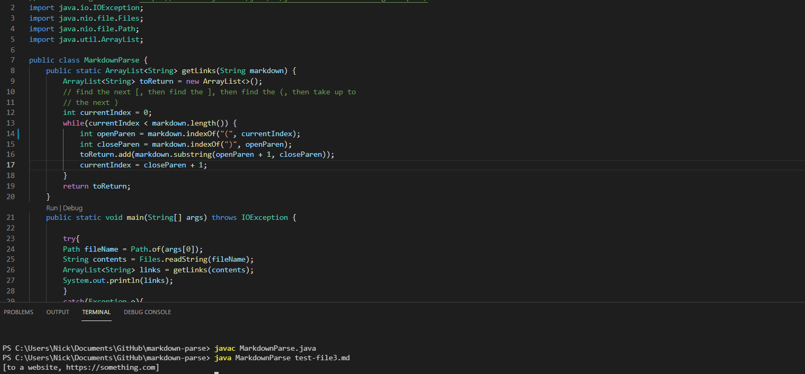

## Original Code
##### Code

##### First Error

The original code finds the hard brackets and then finds the link between the paranthesis after those brackets; however, we get an **error** when no file containing links is passed.
We get an IndexOutofBoundsException that must be resolved. 

## Updated to Account for Test 1
##### Updated Code:

##### Error:

Previously, the **bug** was not passing a file at all, and the **symptom** was the IndexOutofBoundsException. The implemented solution was adding a try catch system that prints out the error and tells the user to try again. However, what if the file caused a bug? In this case, there is another link and set of paranthesis in side of the paranthesis. The **bug** in our code is that we assumed the link would come over the hard brackets not amongst them. As a result, the **symptom** is that we get an unexpected result. Here is the link to the new test/bug: [Test 2](test-file4.md)

## Updated to Account for Test 2
##### Updated Code:

##### Error:

The implemented solution was to simply skip looking for hard brackets. We simply look for the paranthesis and print out whats between them. However, what if what was between paranthesis wasn't a link? In this case, the bug is that we print out whatever is between paranthesis, and we need to determine if those are actually links or not. Here is the link to the new test/bug: [Test 3](test-file3.md)

## Updated to Account for Test 3
##### Updated Code:

While not a perfect implementation, I had it immediately skip strings that contain spaces. No link can contain a space, so I figured it would be an adequate implementation. In this case, the **bug** was that we printed out whatever was between the paranthesis, and the **symptom** was that it printed out things that we did not want it to. 
