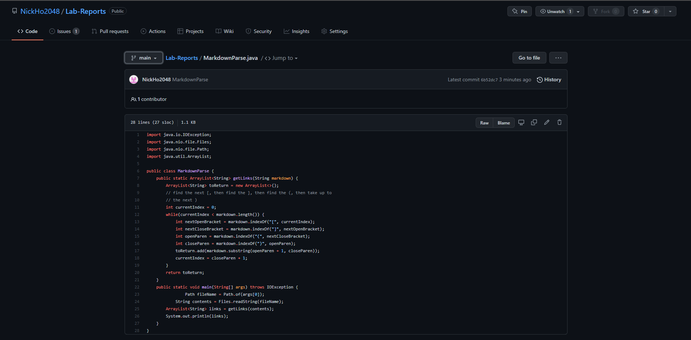
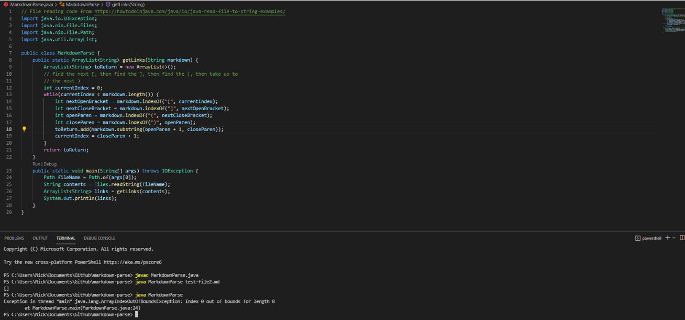
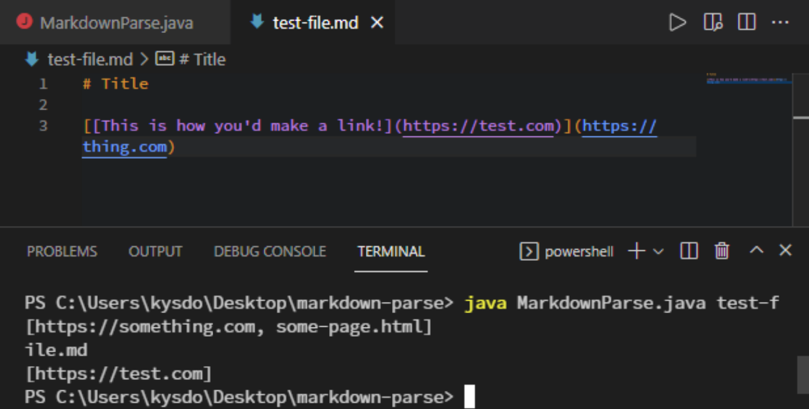
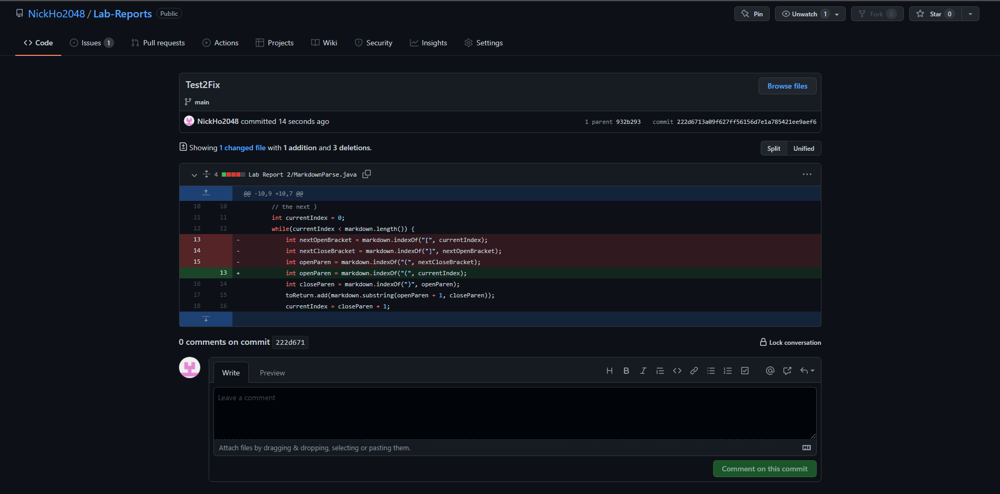
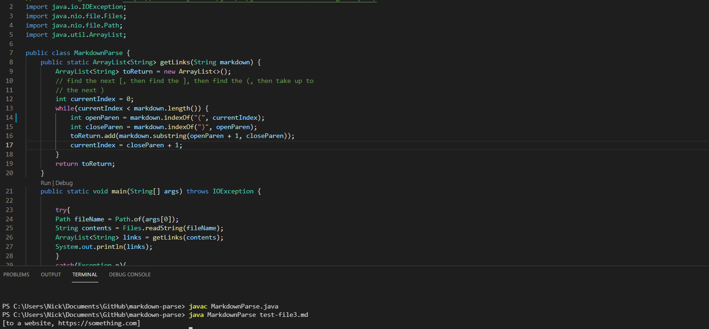

##### Original Code

## Test 1
##### Error:

The original code finds the hard brackets and then finds the link between the paranthesis after those brackets; however, we get **our first test** when no file containing links is passed at all. We get an IndexOutofBoundsException that must be resolved. 
##### Updated Code:

In place of the failure-inducing input/test that caused it (because we were just passing an **empty file**), I am showing the code fix. The **failure-inducing input** was not passing a file at all, and the **symptom** was the IndexOutofBoundsException. The implemented solution was adding a try catch system that prints out the error and tells the user to try again because **the bug** was in how we were reading in the files (it assumed we would be passing in a file at all).

## Test 2
##### Error:

What if the file we did pass caused a bug? In this case, there is another link and set of paranthesis in side of the paranthesis. We get an unexpected result that must be resolved. 
##### Updated Code:

The **bug** in our code is that we assumed the link would come after the hard brackets not amongst them. As a result, the **symptom** is that we get this split list of links as the code loops back through, looking for the paranthesis. The **failure-inducing input** was having the paranthesis containing the links in an unusualy place. The implemented solution was to simply skip looking for hard brackets. We simply look for the paranthesis and print out whats between them. Here is the link to the new test/failure-inducing input: [Test 2](test-file4.md)

## Test 3
##### Error:

 What if what was between paranthesis wasn't a link? In this case, the **bug** is that we print out whatever is between paranthesis, and the **symptom** is that we printed out "link to website," which is what was between the paranthesis. Thus, we need to determine if those are actually links or not. Here is the link to the new test/failure-inducing input: [Test 3](test-file3.md)
##### Updated Code:

While not a perfect implementation, I had it immediately skip strings that contain spaces. No link can contain a space, so I figured it would be an adequate implementation. In this case, the **bug** was that we printed out whatever was between the paranthesis, and the **symptom** was that it printed out things that we did not want it to. The failure inducing input was the file with things other than links in the paranthesis. 
