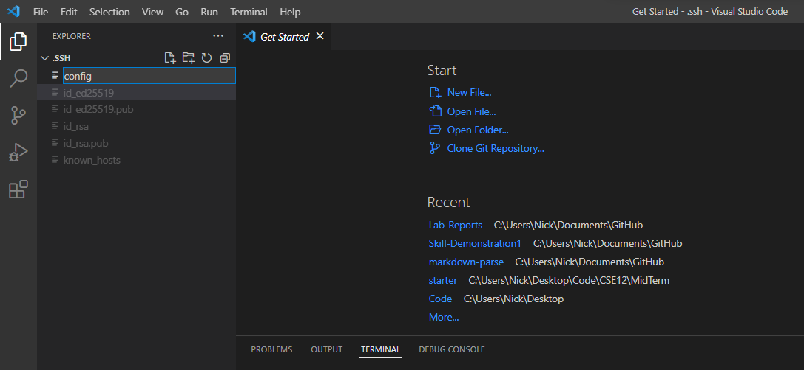

## Streamlining ssh Configuration

##### Step 1:
Ensure ssh key is setup. **See Lab 1  (Setting an SSH Key)** Open VSCode and open the .ssh file. Create a new file and name it config. 

##### Step 2:
In the config file, add the lines `Host [insert name]`, then on a new line `Hostname ieng6.ucsd.edu`, and finally on a new line `User [insert username]`

##### Step 3:
Check to make sure the streamlining process worked. 

##### Step 4:
Use the ssh streamlining process by copying over a file. `Type scp [file location] [insert name]:~/`

