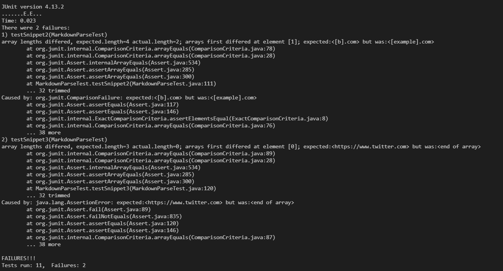

What snippet1 should produce: ("url.com","'google.com'","google.com","ucsd.edu")\
What snippet2 should produce: ("a.com","b.com","a.com(())","example.com")\
What snippet3 should produce: ("https://www.twitter.com","https://ucsd-cse15l-w22.github.io/","https://cse.ucsd.edu/")

## My markdown parse:
[**Link to My Repository**](markdownme)
##### Test for Snippet 1
 
##### Test for Snippet 2

##### Test for Snippet 3

##### Result when tests are run

## The reviewed markdown parse:
[**Link to Reviewed Respository**](markdownthem)
##### Test for Snippet 1
 
##### Test for Snippet 2

##### Test for Snippet 3

##### Result when tests are run

## Answers to Questions:
##### Question 1:
Snippet 1 actually passed with my code. The code splits the passed file into individual lines and then looks for the brackets and paranthesis within each line, so the ` did not affect its output. 

##### Question 2:
It found a.com and example.com. This is because the code was triggered by the brackets and paranathesis within the brackets in the line with a.com and b.com; it found that link (a.com) but then didn't check for more links on that line and moved to the next line. Then, a.com(()) was completely skipped over because of the open paranthesis within the overall paranthesis `if (nextOpenParen != -1 && closeParen > nextOpenParen) {`; it checked for more links afterwards but still skipped over a.com(()). For finding b.com, we need to check after every single hard bracket. So, I would simply remove lines 30 to 33. Then, after line 39, where it checks for the paranthesis, I would have it look around those indexes for more paranthesis\ 
`while(markdown.indexOf(closeParen, closeParen + 1).contains('(') || (markdown.indexOf(closeParen, closeParen + 1).contains(')')){`\
    `closeParen = closeParen + 1;`\
`}`\
Now, the code only looks for the close Bracket and then checks for the paranthesis afterward. However, if there are paranthesis within the link, it will keep shifting the close paranthesis down until it finds the last paranthesis. 

##### Question 3: 
It didn't find any of the links. This is because we divide the file into individual lines and look at those. We need to remove this because the paranthesis and the links are no longer on the same line. Essentially, we will replace lines 68-70 with the contents of the method getLinksfromLine. After this, the code should theoretically work; however, it will keep the new lines, which need to be removed. So, after line 39, we will add\
`while(markdown.indexOf(closeParen, closeParen - 1).contains("\n") || markdown.indexOf(closeParen, closeParen - 1).contains(' ')){`\
    `closeParen = closeParen - 1;`\
`}`\
`while(markdown.indexOf(openParen, openParen + 1).contains("\n") || markdown.indexOf(closeParen, closeParen - 1).contains(' ')){`\
    `openParen = openParen + 1;`\
`}` \
Now, the code will look for the open paranthesis and the close paranthesis. Then, it will remove all the new lines and spaces that are present within the paranthesis; this is okay because links cannot have those anyways. 