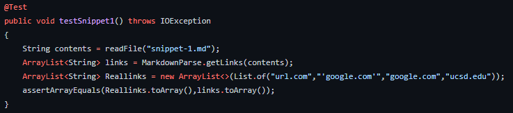
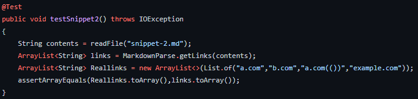
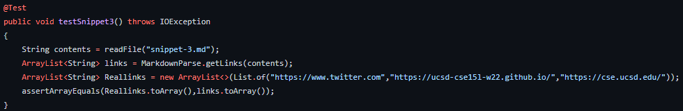
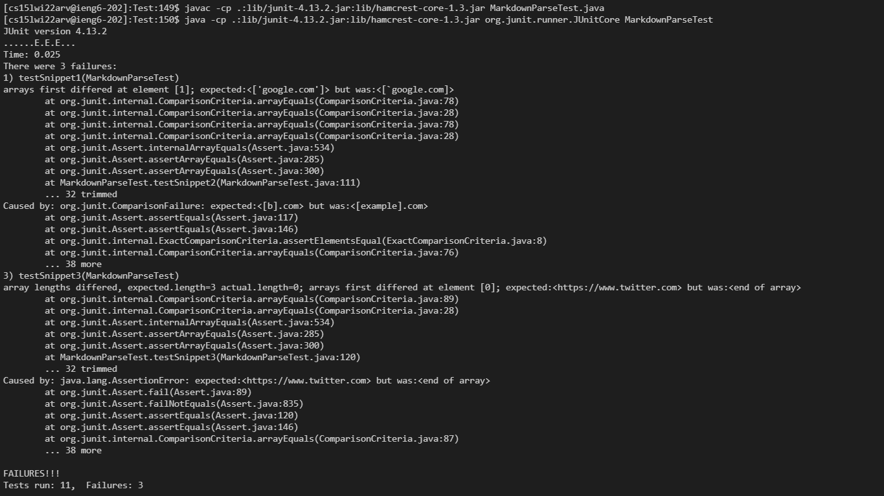
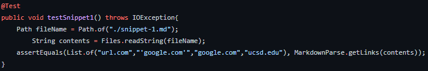
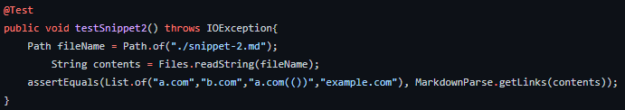
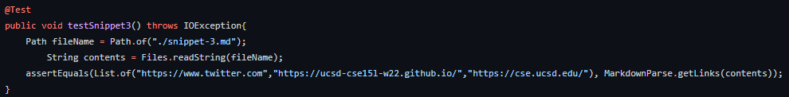
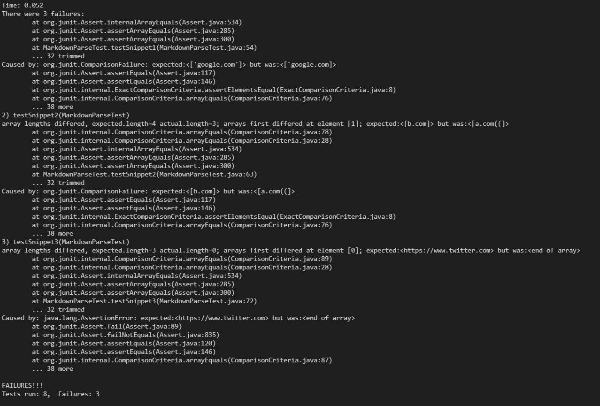

What snippet1 should produce: ("url.com","'google.com'","google.com","ucsd.edu")\
What snippet2 should produce: ("a.com","b.com","a.com(())","example.com")\
What snippet3 should produce: ("https://www.twitter.com","https://ucsd-cse15l-w22.github.io/","https://cse.ucsd.edu/")

## My markdown parse:
[**Link to My Repository**](markdownme)
##### Test for Snippet 1
 
##### Test for Snippet 2

##### Test for Snippet 3

##### Result when tests are run

## The reviewed markdown parse:
[**Link to Reviewed Respository**](markdownthem)
##### Test for Snippet 1
 
##### Test for Snippet 2

##### Test for Snippet 3

##### Result when tests are run
