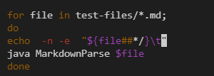
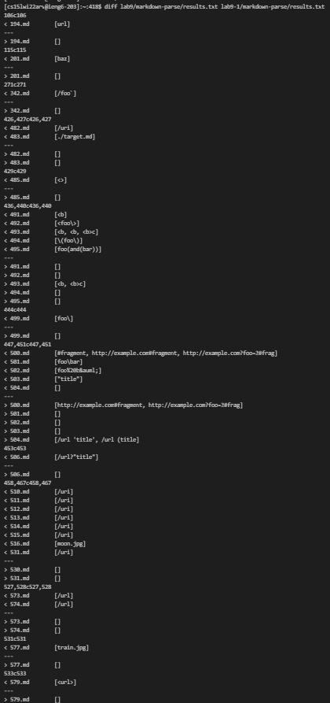
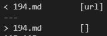
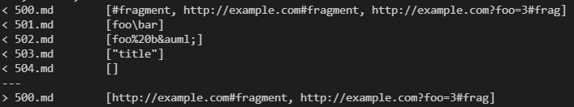

### How I Found the Tests:
 

For each of the versions of markdown parse, I created a script.sh file. It loops through every file with the for loop and returns its output of running the code with that file. The `-n -e` ensures the test file and the output are returned on the same line. (This helps with later comparison to immediately see which test is causing the unexpected output). To store the result, I typed `bash script.sh > results.txt`. This outputs the results of running script.sh into a file named results.txt. I did this with both versions of markdown parse.

Then I typed `diff [insert location of results.txt] [insert location of other results.txt]`. This compared the contents of results.txt and returns the differences between the two files. 

### Test 1: [Test 194](https://github.com/ucsd-cse15l-w22/markdown-parse/blob/main/test-files/194.md)

I think my implementation was correct. Test 194 has the contents: Foo*bar]. I don't see any links, and thus, because my code return nothing at all, I think my implementation was correct. 

### Test 2: [Test 500](https://github.com/ucsd-cse15l-w22/markdown-parse/blob/main/test-files/500.md)

I think my implementation was incorrect. Test 500 has the contents: [Link] (#fragment), [Link] (http://example.com#fragment), [Link] (http://example.com?foo=3#frag). *There were no spaces between the brackets and the paranthesis.* All of them should be valid links. They have the brackets and the paranthesis. The #fragment is likely a link to a repository or folder of some kind and does need a .com at the end to make it a valid link. Ultimately, my code failed to get #fragment and thus there was an error. 