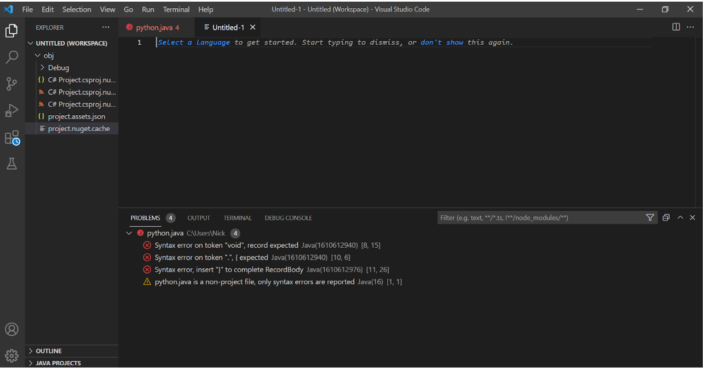
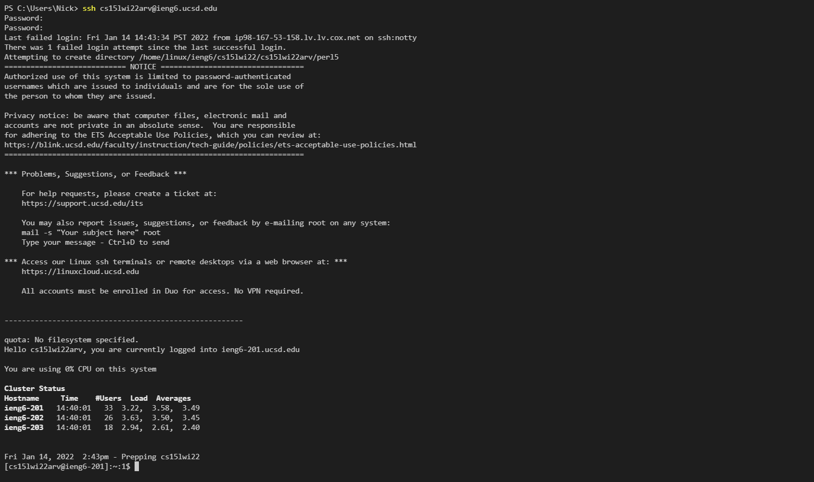
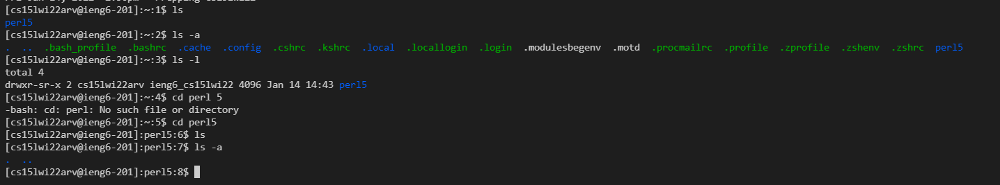
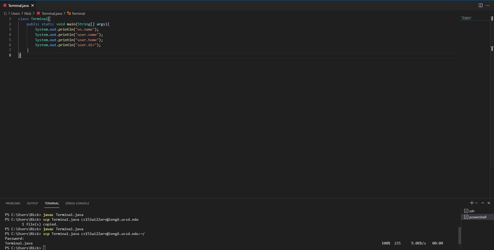
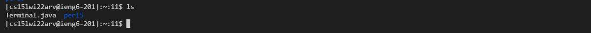
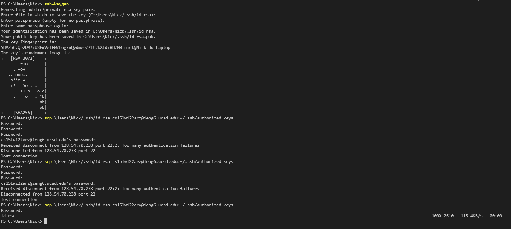
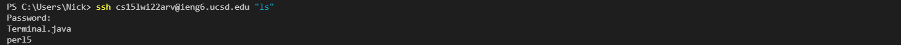

## Step 1: CSE15 Account Setup
Go to account lookup, enter your regular username/PID, then click on the cs15l... account, and click on password change. Then, it takes you to global password reset, where you login with your regular username/PID, and enter your current password and your new password; scroll down to change my tritonlink password (make it no instead of yes), and then check password. At this point, it should take you to a page that says wait 15 minutes.
[Link to Account Lookup](https://sdacs.ucsd.edu/~icc/index.php)

## Step 2: Visual Studio Code
Download Visual Studio Code from this [Link](https://code.visualstudio.com/Download)

## Step 3: Remotely Connecting
Type SSH cs15l...@ieng6.ucsd.edu on your computer; then enter your password. 

## Step 4: Trying Some Commands
Common bash commands include: ls (lists files and directories), ls -a (lists hidden files and directories), ls -l (formats how things are listed), cd (changes directory and thus this will need to be followed by a directory).

## Step 5: Moving Files with SCP
Create some file; in the example, we created a java file that printed out "os.name", "user.name", "user.home", and "user.dir"; then, type scp [insert filename] cs15l...@ieng6.ucsd.edu:~/ on your computer

## Step 6: Setting an SSH Key
First download ssh-add from this [Link](https://docs.microsoft.com/en-us/windows-server/administration/openssh/openssh_keymanagement#user-key-generation); then type out ssh-keygen on your computer; then type the location of the download .ssh/id_rsa file when prompted for a file to save the key, then press enter two times as no passphrase is needed; now ssh into your cs15l...account; type mkdir .ssh on that computer; then return to your computer and type scp [insert location of .ssh/id_rsa.pub file] cs15l...@ieng6.ucsd.edu:~/.ssh/authorized_keys

## Step 7: Optimizing Remote Running
Because of step 6, we do not have to ssh into our cse15 constantly to run commands anymore; we can simply type ssh cs15l...@ieng6.ucsd.edu "[insert command]"; to make things more efficient, you can use the up and down arrows to reuse commands; copying and pasting is also very helpful
\
For example, in this picture, I used the arrows to get the ssh command (+3), then I typed "ls" (+4), and then copy-pasted my password (+6)); this resulted in a total of 13 strokes. 

